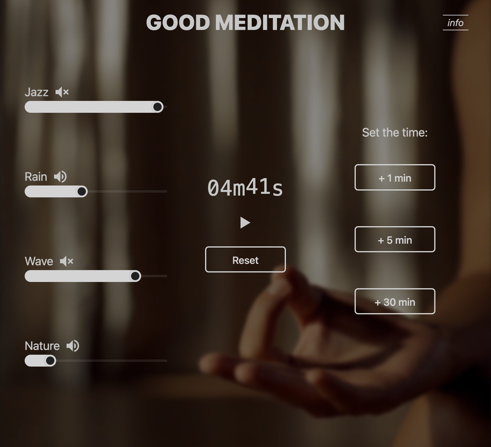

  <h1 align="center">Start2Impact React Project</h1>

## About The Project

This project is made during the course of study I am doing through the [Start2Impact](https://www.start2impact.it/) platform, to certify the skills learned.
Represents a web application developed with React that aims to help people meditate. This is made possible by a timer that can be set at will and by choosing the sounds we like best, even overlapping them. Of the latter, the desired intensity can be set. The project intends to comply with all the directions suggested by the Start2Impact team.
### Built With:

* HTML5
* CSS3
* JavaScript
* [React](https://reactjs.org/)
* [TailwindCSS](https://tailwindcss.com/)
* [DaisyUI](https://daisyui.com/)

## Contact

Start2Impact Profile: [https://talent.start2impact.it/profile/vittorio-gioda](https://talent.start2impact.it/profile/vittorio-gioda)

LikedIn: [https://www.linkedin.com/in/vittorio-gioda/](https://www.linkedin.com/in/vittorio-gioda/)

Project Link: [https://github.com/Teygeta/Project_Start2Impact_JS](https://github.com/Teygeta/Project_Start2Impact_JS)
